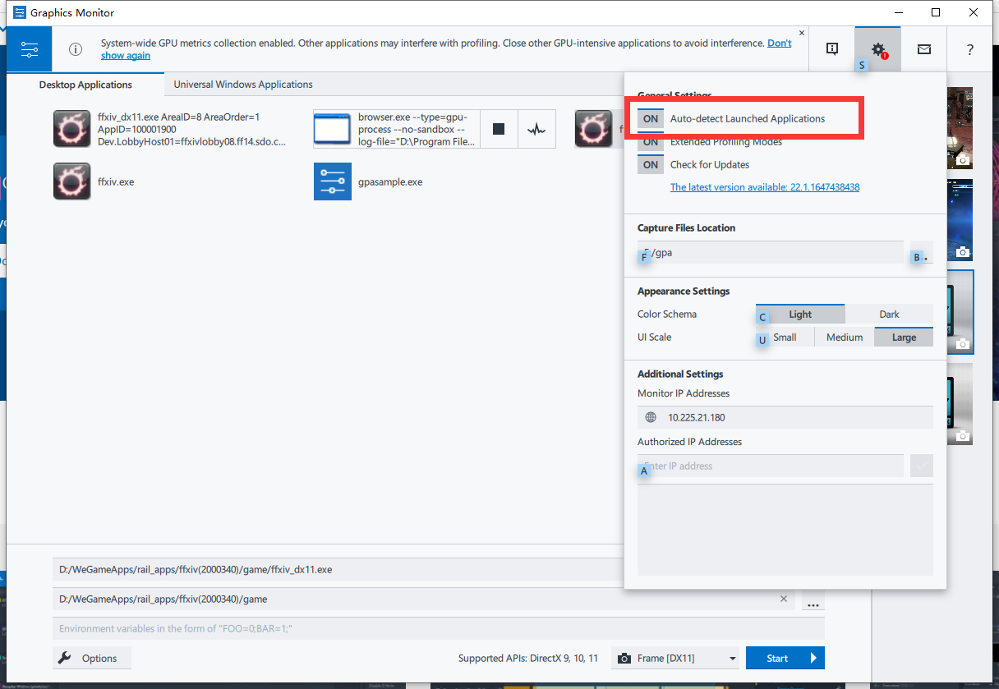

# GPA

[官方下载地址](https://www.intel.com/content/www/us/en/developer/tools/graphics-performance-analyzers/overview.html)

[官方手册（使用时最后一起看）](https://www.intel.com/content/www/us/en/develop/documentation/gpa-user-guide/top.html)

1. 启动Graphics Monitor
2. 如果exe可以直接打开，在下方选择文件夹地址，如图1所示

 (1).png>)

3\. 如果不能直接打开（比如steam等需要启动器的游戏），点击上方setting按钮（齿轮），打开Auto-detect Launched Applications开关，然后启动游戏

4\. 在游戏里截取frame后，用FrameAnalyzer.exe分析数据
